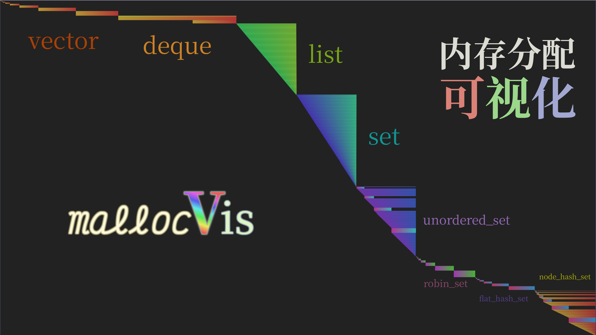
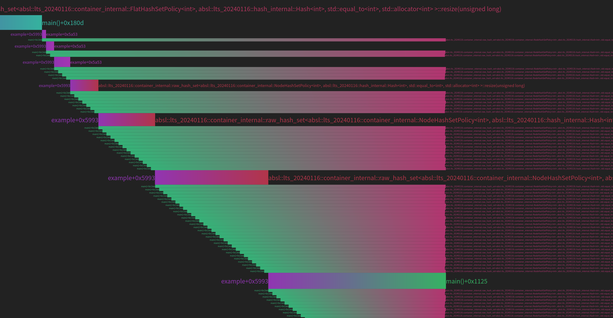

# mallocvis

mallocvis是一个小彭老师自主研发的一款用于可视化C/C++程序中动态内存分配的工具。它可以帮助开发者更直观地了解程序中的内存分配情况，从而更容易发现内存泄漏、内存碎片化或者内存使用不当的问题。

mallocvis的工作原理是通过hook C/C++中的内存分配函数，如malloc、free、realloc、operator new、operator delete等，来跟踪程序中的内存分配和释放操作。它将跟踪到的内存分配信息以可视化的形式展示出来，包括内存块的大小、地址和持续时间等。



颜色表示调用者地址，高度表示分配的内存块大小，长度表示内存块持续在内存中存在的时间。

渐变表示 malloc 的调用者和 free 的调用者分别位于不同的地址，相隔较近的地址颜色会接近。

内存泄漏的块将体现为延伸至末尾的黑色渐变长条。

要使用 mallocvis，只需为你的可执行程序链接 libmallocvis.so（编译本项目即可获得）。

你可以利用 LD_PRELOAD 环境变量来迫使用户程序加载 libmallocvis.so，从而在程序运行时自动使用 mallocvis。

```bash
LD_PRELOAD=libmallocvis.so ./program
```

运行后，将会在当前目录（或 build 目录）下生成 `malloc.html` 文件，用浏览器打开即可查看可视化结果。

使用鼠标拖拽可以移动，滚轮缩放，双击恢复原始大小。

通过环境变量 MALLOCVIS 可以指定各种选项：

```bash
export MALLOCVIS="format:svg;path:malloc.html;height_scale:log;z_indicates:thread;show_text:1;text_max_height:24;text_height_fraction:0.4;filter_cpp:1;filter_c:1;filter_cuda:1;svg_margin:420;svg_width:2000;svg_height:1460"
```

[cover2.png](cover2.png)

# Mallocvis

Mallocvis is a tool developed by Xiaopeng to visualize dynamic memory allocation in C/C++ programs. It helps developers get a better understanding of memory allocation in their programs, making it easier to detect memory leaks, memory fragmentation, or improper memory usage.

The working principle of mallocvis is to hook memory allocation functions in C/C++, such as malloc, free, realloc, operator new, operator delete, etc., to track memory allocation and deallocation operations in the program. It visualizes the tracked memory allocation information, including the size, address, and duration of the memory blocks.

!

The color represents the caller's address, the height represents the size of the allocated memory block, and the length represents the duration of the memory block's existence in memory.

The gradient represents that the caller of malloc and the caller of free are located at different addresses, and the colors of nearby addresses will be similar.

Memory leaks will be reflected as black gradient bars that extend to the end.

To use mallocvis, simply link libmallocvis.so against your executable (compiled from this project).

You can use the LD_PRELOAD environment variable to force the user program to load libmallocvis.so, thus automatically using mallocvis during program execution.

```bash
LD_PRELOAD=libmallocvis.so ./program
```

After running, a `malloc.html` file will be generated in the current directory (or the build directory), which can be opened in a browser to view the visualization results.

You can use the mouse to drag and drop to move, scroll to zoom, and double-click to restore the original size.

Options can be specified through the environment variable MALLOCVIS:

```bash
export MALLOCVIS="format:svg;path:malloc.html;height_scale:log;z_indicates:thread;show_text:1;text_max_height:24;text_height_fraction:0.4;filter_cpp:1;filter_c:1;filter_cuda:1;svg_margin:420;svg_width:2000;svg_height:1460"
```


